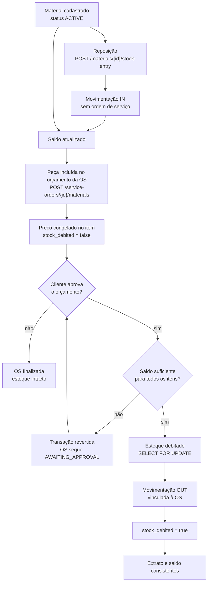
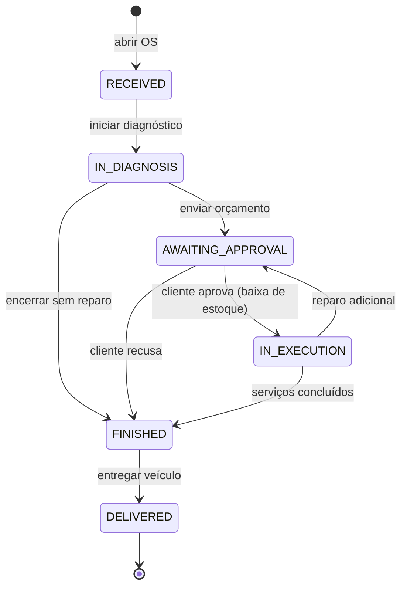
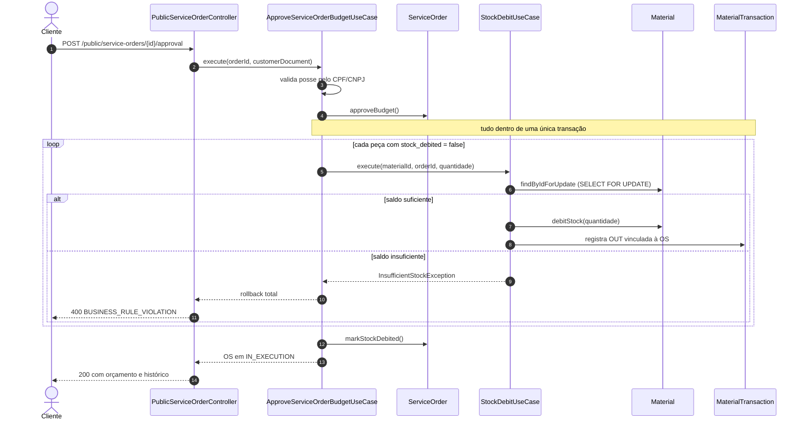
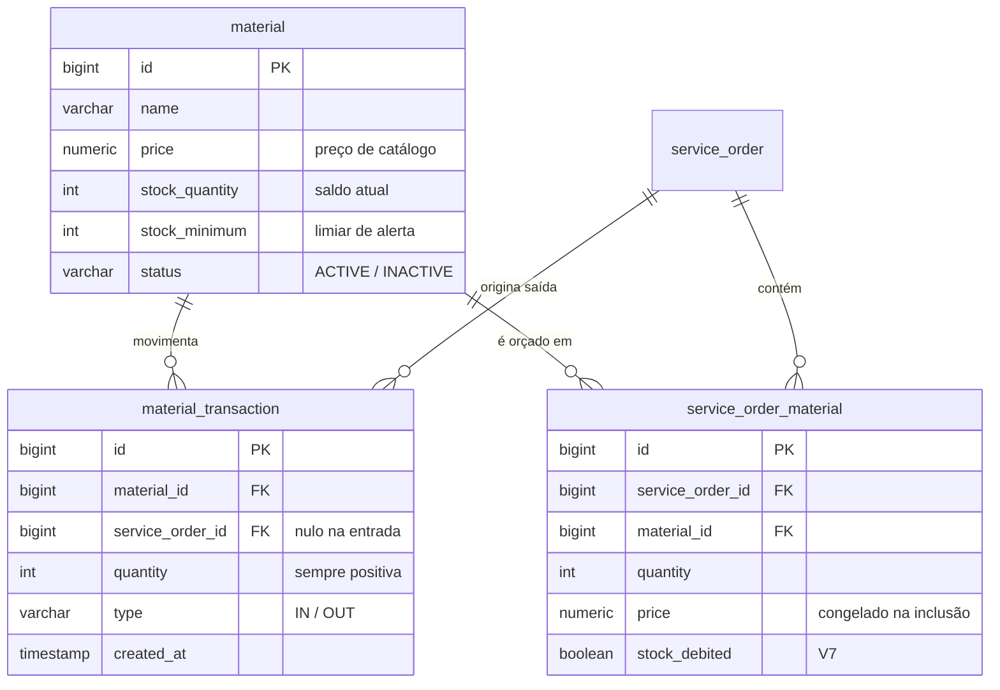

# Event Storming — Peças e Insumos (Materiais)

Mapa do subdomínio de estoque como a aplicação o implementa hoje. Notação: **evento** (passado),
**comando** (imperativo), **política** (reação automática), **leitura** (consulta), **hotspot** (em aberto).

## 1. Cadastro no catálogo

| Tipo | Item | Onde |
|---|---|---|
| Ator | Atendente | `Employee` ACTIVE |
| Comando | Cadastrar material | `POST /api/materials` |
| Agregado | `Material` | recusa preço/saldo/mínimo negativos; nome único |
| Evento | **Material cadastrado** | status ACTIVE, saldo inicial e mínimo definidos |
| Comando | Atualizar material | `PUT /api/materials/{id}` |
| Evento | **Material atualizado** | nome, descrição, preço, mínimo |
| 🔴 Hotspot | Saldo inicial não gera movimentação | o extrato não explica o saldo |
| 🔴 Hotspot | O update regrava `stockQuantity` | baixa manual disfarçada de edição de catálogo |

## 2. Reposição de estoque

| Tipo | Item | Onde |
|---|---|---|
| Comando | Registrar entrada | `POST /api/materials/{id}/stock-entry` |
| Agregado | `Material.addStock()` | exige quantidade > 0 |
| Evento | **Estoque reposto** | saldo aumenta |
| Evento | **Movimentação de entrada registrada** | `type = IN`, sem ordem de serviço |
| 🔴 Hotspot | Entrada sem lock pessimista | duas reposições simultâneas perdem uma |

## 3. Peça entra no orçamento

| Tipo | Item | Onde |
|---|---|---|
| Ator | Mecânico | — |
| Comando | Incluir peça na OS | `POST /api/service-orders/{id}/materials` |
| Política | Só material `ACTIVE` entra | `InactiveMaterialException` |
| Agregado | `ServiceOrder` | item com preço unitário congelado |
| Evento | **Peça incluída na ordem** | `stock_debited = false` |
| Evento | **Orçamento recalculado** | Σ serviços + Σ (preço × quantidade) |
| 🔴 Hotspot | Não existe reserva | outra OS pode consumir a peça antes da aprovação |

## 4. Aprovação dispara a baixa (evento pivô)

| Tipo | Item | Onde |
|---|---|---|
| Ator | Cliente | rota pública, sem token |
| Comando | Aprovar orçamento | `POST /public/service-orders/{id}/approval` |
| Evento | **Orçamento aprovado** | `AWAITING_APPROVAL → IN_EXECUTION` |
| Política | Debitar cada peça pendente | só itens com `stock_debited = false` |
| Agregado | `Material.debitStock()` | `SELECT ... FOR UPDATE` |
| Evento | **Estoque debitado** | mesma transação da mudança de status |
| Evento | **Movimentação de saída registrada** | `type = OUT`, com `service_order_id` |
| Evento | **Baixa recusada por estoque insuficiente** | transação revertida; OS segue `AWAITING_APPROVAL` |
| 🔴 Hotspot | Aprovação é tudo ou nada | faltando um item, nenhum é debitado |

## 5. Recusa e devolução

| Tipo | Item | Onde |
|---|---|---|
| Comando | Recusar orçamento | `approved: false` |
| Evento | **Orçamento recusado** | OS vai para `FINISHED`, motivo em `observation` |
| 🔴 Hotspot | Não existe estorno | peça debitada não volta; devolução vira entrada avulsa |
| 🔴 Hotspot | Recusa de adicional encerra a OS | deveria voltar para `IN_EXECUTION` |

## 6. Consulta, alerta e descontinuação

| Tipo | Item | Onde |
|---|---|---|
| Leitura | Catálogo | `GET /api/materials?status=` |
| Leitura | Abaixo do mínimo | `GET /api/materials/low-stock` (saldo **<** mínimo) |
| Leitura | Extrato do material | `GET /api/materials/{id}/transactions` |
| Leitura | Extrato geral | `GET /api/material-transactions?type=IN\|OUT` |
| Comando | Inativar material | `PATCH /api/materials/{id}/status` |
| Evento | **Material inativado** | sai das listagens, não entra em OS, não sofre baixa |
| Política | Nada é deletado | histórico e extrato preservados |
| 🔴 Hotspot | Alerta é consultado, não notificado | ninguém é avisado ao cruzar o mínimo |

## Fronteira do subdomínio

`Material` e `MaterialTransaction` são agregados próprios. `ServiceOrder` os referencia por id e
**nunca altera saldo direto** — a única porta de saída do estoque é a política de baixa disparada
pela aprovação do orçamento.

---

## Diagramas

### Ciclo de vida da peça

### Máquina de estados da OS

### Aprovação e baixa atômica

### Modelo de dados do estoque

